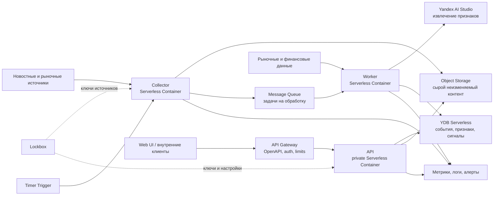

# EventEdge — технический дизайн MVP

> Версия 0.1 от 8 августа 2026 года. Цель документа — зафиксировать реализуемую архитектуру и API-контракт для первой версии в Yandex Cloud с бюджетом до 10 000 ₽ в месяц.

## 1. Ключевое решение

EventEdge строится как **API-first serverless-система**.

- Все клиенты работают только через версионированный REST API.
- Сбор и анализ новостей выполняются асинхронно и не блокируют пользовательский интерфейс.
- LLM извлекает из текста структурированные признаки, но не назначает итоговый сигнал.
- Сигнал рассчитывает и калибрует отдельный алгоритмический модуль.
- Необработанные данные сохраняются, поэтому любую версию модели можно воспроизвести и сравнить с предыдущей.
- Каждый дорогой компонент имеет лимит, режим деградации и возможность отключения.

Для MVP не нужны Kubernetes, Kafka, выделенный PostgreSQL, ClickHouse или OpenSearch. Они добавят постоянные расходы и операционную сложность раньше, чем появится подтверждённая нагрузка.

## 2. Архитектура



### Компоненты MVP

| Компонент | Сервис Yandex Cloud | Зачем нужен |
|---|---|---|
| Единая точка входа | API Gateway | OpenAPI 3.0, проверка запросов, авторизация, rate limit, Swagger UI |
| API | Serverless Containers | Отдача сигналов, событий, истории и настроек |
| Collector | Serverless Containers + Timer Trigger | Регулярный опрос подключённых источников |
| Очередь | Message Queue | Развязка сбора и анализа, повторы, DLQ |
| Worker | Serverless Containers + Message Queue Trigger | Дедупликация, LLM-разбор, факторы и расчёт сигнала |
| Операционная БД | YDB Serverless | Состояние задач, события, признаки, сигналы и конфигурация |
| Сырой архив | Object Storage | Исходные документы и версии расчётов для воспроизводимости |
| Анализ текста | Yandex AI Studio | Структурированное извлечение событий, компаний, фактов и чисел |
| Секреты | Lockbox | Ключи источников и сервисные секреты |
| Наблюдаемость | Monitoring / Monium и системные логи | Ошибки, задержки, расходы и качество данных |

`api`, `collector` и `worker` можно собирать из одного Docker-образа с разными командами запуска. Это оставляет независимое масштабирование, но не создаёт три отдельных кодовых базы.

## 3. Как проходит новость

1. Timer Trigger запускает `collector` каждые 2–5 минут.
2. Collector получает только новые материалы от включённых источников.
3. Для каждого материала вычисляется стабильный `news_id` и точный хеш содержимого. Повторная загрузка безопасно игнорируется.
4. Исходный документ сохраняется в Object Storage; в YDB записывается его метаинформация.
5. Дешёвые правила отсекают технический мусор и очевидно нерелевантные материалы. Похожие новости объединяются в одно событие до вызова LLM.
6. В Message Queue отправляется ссылка на документ, а не полный текст.
7. Worker выбирает режим обработки:
   - **fast lane** — синхронный YandexGPT Lite для срочных и потенциально существенных событий;
   - **economy lane** — асинхронный YandexGPT Lite для остального потока и исторического backfill.
8. LLM возвращает только JSON по фиксированной схеме: тип события, затронутые инструменты, факты, числа, временной контекст, оценку новизны и текстовое обоснование.
9. Worker валидирует JSON, объединяет текстовые признаки с рыночными и финансовыми факторами и рассчитывает сигнал алгоритмически.
10. Новая ревизия сигнала записывается в YDB. Предыдущая не перезаписывается, а получает статус `superseded`.
11. UI получает свежий рейтинг через API. После окончания горизонта отдельная задача рассчитывает фактический исход сигнала.

Если LLM недоступна, материал не теряется: он остаётся в очереди или архиве. Если после повторов признаков всё ещё недостаточно, система формирует `neutral` либо не публикует сигнал — в зависимости от политики качества.

## 4. Как формируется итоговый сигнал

В первой версии нужен простой, прозрачный baseline:

```text
LLM JSON + рыночные данные + данные компании
                  ↓
          нормализованные факторы
                  ↓
       взвешенная модель / классификатор
                  ↓
       калибровка вероятностей на истории
                  ↓
 direction + action + strength + confidence
```

Пример групп факторов, а не жёстко заданной навсегда формулы:

- текстовый эффект и новизна события;
- изменение фактических показателей компании;
- реакция цены и объёма;
- волатильность, ликвидность и состояние рынка;
- свежесть, полнота и согласованность данных.

### Правила результата

- `direction = up`, если ожидаемое движение после издержек положительно и вероятность выше откалиброванного порога;
- `direction = down`, если ожидаемое движение после издержек отрицательно и вероятность выше порога;
- во всех остальных случаях `direction = neutral`;
- `confidence` рассчитывается из качества данных и калибровки модели, а не берётся из самооценки LLM;
- действие выводится из направления: `consider_buy`, `no_action` или `review_position`;
- автоматической сделки в MVP нет.

Порог и веса хранятся как версионированная конфигурация. Любой опубликованный сигнал обязан содержать `model_version`, `config_version` и `data_cutoff_at`.

## 5. API как основной продуктовый контракт

Полный стартовый контракт находится в [openapi.yaml](openapi.yaml). Значения `${API_CONTAINER_ID}` и `${GATEWAY_SERVICE_ACCOUNT_ID}` подставляются при деплое; схема авторизации Gateway добавляется deployment-overlay и дополнительно проверяется приложением.

### Основные ресурсы

| Ресурс | Назначение |
|---|---|
| `Signal` | Инвестиционная гипотеза и предлагаемое действие |
| `Event` | Нормализованное событие, собранное из одной или нескольких новостей |
| `InstrumentSnapshot` | Текущее состояние инструмента и активный сигнал |
| `Job` | Статус асинхронной загрузки или перерасчёта |
| `Source` | Настройки новостного источника |
| `ScoringConfig` | Версия порогов и весов модели |
| `Feedback` | Решение аналитика по сигналу и причина |

### Эндпоинты MVP

```text
GET   /v1/signals
GET   /v1/signals/{signal_id}
GET   /v1/events
GET   /v1/events/{event_id}
GET   /v1/instruments/{ticker}/snapshot

POST  /v1/internal/news
GET   /v1/jobs/{job_id}

POST  /v1/signals/{signal_id}/feedback

GET   /v1/admin/sources
POST  /v1/admin/sources
GET   /v1/admin/sources/{source_id}
PATCH /v1/admin/sources/{source_id}
POST  /v1/admin/sources/{source_id}/validate
GET   /v1/admin/scoring-config
PUT   /v1/admin/scoring-config

GET   /health/live
GET   /health/ready
```

### Минимальный объект сигнала

```json
{
  "id": "sig_01JZK6K5GDX90Q2X8C0R4D7M9P",
  "ticker": "SBER",
  "as_of": "2026-08-08T09:15:00Z",
  "data_cutoff_at": "2026-08-08T09:14:32Z",
  "status": "active",
  "direction": "up",
  "action": "consider_buy",
  "horizon": {"value": 3, "unit": "trading_days"},
  "score": 42.7,
  "strength": 0.71,
  "confidence": 0.76,
  "summary": "Новая информация улучшила краткосрочную оценку, а рыночная реакция пока не выглядит полной.",
  "factor_contributions": [
    {"code": "news_impact", "contribution": 0.38, "label": "Эффект события"},
    {"code": "market_reaction", "contribution": 0.21, "label": "Реакция рынка"}
  ],
  "evidence_refs": ["evt_01JZK5Y4V2JABR9N4F0S7Q2XWC"],
  "expires_at": "2026-08-13T15:45:00Z",
  "invalidation_conditions": ["Появились опровергающие сведения"],
  "model_version": "baseline-0.1.0",
  "config_version": 7,
  "created_at": "2026-08-08T09:15:04Z"
}
```

### Обязательные правила интерфейса

1. **Версионирование:** `/v1`; совместимые поля добавляются без смены версии, несовместимые изменения идут в `/v2`.
2. **Время:** только UTC в RFC 3339. Биржевую дату и торговую сессию отдаём отдельными полями, если они нужны клиенту.
3. **Воспроизводимость:** у сигнала обязательны `data_cutoff_at`, версии модели и конфигурации.
4. **Иммутабельность:** опубликованный сигнал не редактируется; создаётся новая ревизия, старая становится `superseded`.
5. **Идемпотентность:** все команды `POST` принимают `Idempotency-Key`; повтор возвращает тот же результат.
6. **Пагинация:** cursor-based; offset не используется. Сортировка стабильна: время плюс идентификатор.
7. **Ошибки:** единый `application/problem+json` с `type`, `title`, `status`, `code`, `detail`, `request_id`.
8. **Трассировка:** клиент может передать `X-Request-Id`; сервис всегда возвращает `X-Request-Id` и пишет его во все логи.
9. **Деньги и точные величины:** decimal передаются строкой; float допустим только для нормализованных скоров и вероятностей.
10. **Неизвестность:** отсутствие данных выражается явным `null` или статусом качества, а не пропуском критического поля.
11. **Кеширование:** списки и snapshot поддерживают `ETag` / `If-None-Match`.
12. **Лимиты:** `limit` по умолчанию 20, максимум 100; размер тела запроса ограничивается в Gateway.

### Definition of Done для API

- сначала меняется OpenAPI-контракт, затем реализация и UI-клиент;
- спецификация проходит YAML/OpenAPI lint и проверку обратной совместимости;
- клиент для UI генерируется из схемы, вручную типы ответа не дублируются;
- Gateway и приложение валидируют вход, а contract-тесты проверяют ответы;
- у каждого endpoint есть успешный пример, ошибки и проверка прав доступа;
- интеграционный тест проходит путь `ingest → job → event → signal`;
- перед релизом проверяются повтор с тем же `Idempotency-Key`, cursor pagination, `ETag` и конкурентное изменение через `If-Match`;
- документация `/docs` строится из той же версии спецификации, которая развёрнута в Gateway.

### Авторизация

- Контейнеры закрыты от публичного вызова; обращаться к ним может только API Gateway от имени service account.
- Пользовательский API принимает Bearer-токен через authorizer.
- Сервисная загрузка новостей использует отдельную схему авторизации и отдельный service account.
- Роли MVP: `viewer`, `analyst`, `admin`, `ingestor`.
- Настройки и секреты никогда не возвращаются через API; источник показывает только маскированный статус подключения.
- Swagger UI можно открыть на `/docs`, но только после той же авторизации.

### Быстрый UI

UI остаётся тонким React-приложением без собственной логики расчёта сигнала. Типизированный клиент генерируется из `openapi.yaml`. Первая версия содержит три экрана: рейтинг сигналов, карточку сигнала и настройки источников/модели. Статическую сборку можно хранить в Object Storage и раздавать через API Gateway; SSR для внутреннего MVP не нужен.

## 6. Данные и хранение

### YDB Serverless

В YDB хранятся небольшие структурированные записи:

- `news_items` — метаданные исходных материалов и ссылка на Object Storage;
- `events` и `event_news` — нормализованные события и их источники;
- `feature_sets` — признаки с версиями экстрактора;
- `signals` и `signals_by_ticker` — ревизии сигналов и индекс чтения;
- `evaluation_epochs` — накопленные outcomes отдельно по каждой паре `model_version + config_version`;
- `evaluation_observations` — append-only 10-минутные market observations с составным ключом эпохи, сигнала и времени; новые пересчёты не удаляют старые строки;
- `jobs` — состояние асинхронных операций;
- `assessment_snapshots` — канонические 30-секундные снимки главной страницы с автоматическим удалением устаревших записей;
- `sources` и `scoring_configs` — административная конфигурация;
- `feedback` — обратная связь аналитиков.

Схема проектируется под конкретные запросы API, без тяжёлых аналитических join. Для защиты бюджета задаются лимит RU/s и максимальный размер базы.

### Object Storage

Путь сырого документа:

```text
s3://eventedge-raw/source={source_id}/date={yyyy-mm-dd}/{news_id}.json.gz
```

Объект содержит исходный ответ источника, нормализованный текст, хеш и время получения. Бакет приватный, шифрование включено, lifecycle удаляет или переводит старые документы по утверждённой политике хранения.

## 7. Бюджет до 10 000 ₽ в месяц

**В бюджет входит только инфраструктура Yandex Cloud.** Платные лицензии новостных, биржевых и финансовых источников считаются отдельно; в MVP нужны бесплатные источники, уже имеющиеся договоры либо отдельное согласование.

Оценка ниже — не счёт Yandex Cloud, а рабочая модель расходов. Она основана на следующих пределах MVP:

- до 50 000 сырых материалов в месяц;
- не более 30 000 уникальных и релевантных материалов после фильтрации;
- в среднем 1 200 входящих и 200 исходящих токенов на LLM-разбор;
- 30% материалов обрабатываются синхронно, 70% — асинхронно;
- до 1 млн клиентских API-вызовов в месяц;
- YDB ограничена по RU/s и объёму данных;
- старый сырой контент сжимается и удаляется по lifecycle.

### Плановый бюджет

| Статья | План, ₽/мес. | Как удерживаем |
|---|---:|---|
| YandexGPT Lite | 5 460 | Дедупликация до LLM, лимит токенов, 30% sync / 70% async, без автоматического fallback на Pro |
| Serverless Containers | 300–600 | `min_instances = 0`, короткие батчи, отдельное масштабирование API и worker |
| YDB Serverless | 200–500 | Лимит RU/s, максимум объёма, простые access patterns |
| API Gateway | 0–150 | При 1 млн вызовов стоимость самих вызовов мала; контролируем трафик и ответы |
| Message Queue | 0–50 | Батчи, сообщения меньше 64 КБ, первые 100 тыс. запросов бесплатны |
| Object Storage | 50–150 | Сжатие, приватный бакет, lifecycle |
| Lockbox, Registry, логи и мониторинг | 200–500 | Мало версий секретов, кеширование секретов, ограничение debug-логов |
| Резерв на всплески | 1 500–2 000 | Не расходуется как штатная мощность |
| **Итого** | **7 710–9 410** | Рабочая цель — не выше 8 500 ₽, минимум 1 500 ₽ оставляем буфером |

Расчёт LLM:

```text
9 000 fast × 1,4 тыс. токенов × 0,2 ₽ = 2 520 ₽
21 000 economy × 1,4 тыс. токенов × 0,1 ₽ = 2 940 ₽
Итого: 5 460 ₽/мес.
```

Асинхронный режим может занимать от нескольких минут до нескольких часов, поэтому им нельзя обрабатывать срочные события. Выбор lane делается до LLM по дешёвому конфигурируемому `priority_score`.

### Автоматические ограничители

| Текущие расходы | Действие системы |
|---:|---|
| 6 000 ₽ | Уведомление владельцу и отчёт по главным статьям расхода |
| 8 000 ₽ | Сократить входной текст, оставить fast lane только для приоритетных источников и событий |
| 9 000 ₽ | Остановить economy lane; материалы продолжают сохраняться без LLM |
| 9 500 ₽ | Остановить новые LLM-вызовы; ingestion и read API продолжают работать |

Billing Budget сам по себе только отправляет уведомления и не останавливает ресурсы. Поэтому budget trigger должен вызывать служебный endpoint, который меняет `cost_mode` в конфигурации. Отложенные документы можно обработать в следующем периоде после ручного подтверждения.

## 8. Надёжность и наблюдаемость

### Цели MVP

| Показатель | Цель |
|---|---:|
| Доступность read API | 99,5% в месяц |
| p95 ответа read API | менее 700 мс без холодного старта |
| Задержка fast lane | p95 менее 5 минут от получения новости до сигнала |
| Потерянные принятые новости | 0 |
| Доля сообщений в DLQ | менее 0,5% |
| Воспроизводимые сигналы | 100% |

### Метрики

- `news_received_total`, `news_filtered_total`, `news_duplicate_total`;
- `queue_age_seconds`, `worker_failures_total`, `dlq_size`;
- `llm_requests_total`, `llm_tokens_total`, `llm_invalid_json_total`, `llm_cost_rub`;
- `signal_created_total`, распределение направлений и confidence;
- `api_latency_ms`, `api_errors_total` по route и status;
- полнота данных, доля нейтральных результатов, drift факторов;
- расходы по сервисам и текущий `cost_mode`.

Для повторов используется exponential backoff. После ограниченного числа попыток сообщение попадает в DLQ; из DLQ оно возвращается только после исправления причины. Невалидный JSON LLM не должен бесконечно повторяться.

## 9. Безопасность

- отдельные service accounts для Gateway, API, collector и worker;
- минимальные IAM-роли для каждого аккаунта;
- приватные контейнеры и бакеты;
- ключи источников только в Lockbox;
- шифрование трафика и данных штатными средствами Yandex Cloud;
- запрет текста новостей, токенов и секретов в прикладных логах;
- аудит всех изменений источников и scoring-конфигурации;
- `PUT /admin/scoring-config` создаёт новую версию, но не редактирует опубликованную;
- ручное подтверждение для включения нового источника и новой модели в production;
- разные облачные каталоги или как минимум разные service accounts для `dev` и `prod`.

## 10. Порядок реализации

### Инкремент 1 — вертикальный срез

Один источник → raw storage → очередь → фиктивный extractor → baseline score → `GET /v1/signals` → простой UI.

Критерий готовности: одна и та же новость не создаёт дублей, сигнал воспроизводится по исходным данным, API соответствует OpenAPI.

### Инкремент 2 — реальный LLM-разбор

YandexGPT Lite со строгой JSON-схемой, валидацией, fast/economy lane, токен-бюджетом и DLQ.

Критерий готовности: измерены цена и задержка на реальном потоке; невалидные ответы не ломают pipeline.

### Инкремент 3 — алгоритмический baseline

Рыночные и финансовые признаки, `neutral`-зона, версии модели, backtest и фиксация outcome.

Критерий готовности: LLM не назначает направление; результат можно пересчитать point-in-time без данных из будущего.

### Инкремент 4 — админка и контроль качества

Источники, версии конфигурации, статусы очередей, расходы, качество данных и обратная связь аналитика.

Критерий готовности: оператор может безопасно включить источник, откатить конфигурацию и остановить LLM-затраты без деплоя.

## 11. Решения, которые пока откладываем

- публичное API для внешних клиентов и биллинг по API-ключам;
- автоматическая торговля и интеграция с брокером;
- потоковый транспорт вместо Message Queue;
- собственный model serving;
- полнотекстовый поисковый кластер;
- микросервисы по одному на каждый тип фактора;
- выделенная аналитическая БД.

К ним стоит возвращаться только после измерения нагрузки и качества сигнала.

## 12. Официальные материалы Yandex Cloud

- [API Gateway: возможности и OpenAPI-расширения](https://yandex.cloud/ru/docs/api-gateway/)
- [API Gateway: тарифы](https://yandex.cloud/ru/docs/api-gateway/pricing)
- [Serverless Containers: тарифы](https://yandex.cloud/ru/docs/serverless-containers/pricing)
- [Message Queue: тарифы](https://yandex.cloud/ru/docs/message-queue/pricing)
- [YDB Serverless: тарифы](https://yandex.cloud/ru/docs/ydb/pricing/serverless)
- [Object Storage: тарифы](https://yandex.cloud/ru/docs/storage/pricing)
- [AI Studio: тарифы](https://aistudio.yandex.ru/docs/ru/ai-studio/pricing.html)
- [AI Studio: режимы обработки](https://aistudio.yandex.ru/docs/ru/ai-studio/concepts/generation/index.html)
- [Billing Budget и ограничения](https://yandex.cloud/ru/docs/billing/concepts/budget)
- [Lockbox: тарифы](https://yandex.cloud/ru/docs/lockbox/pricing)
